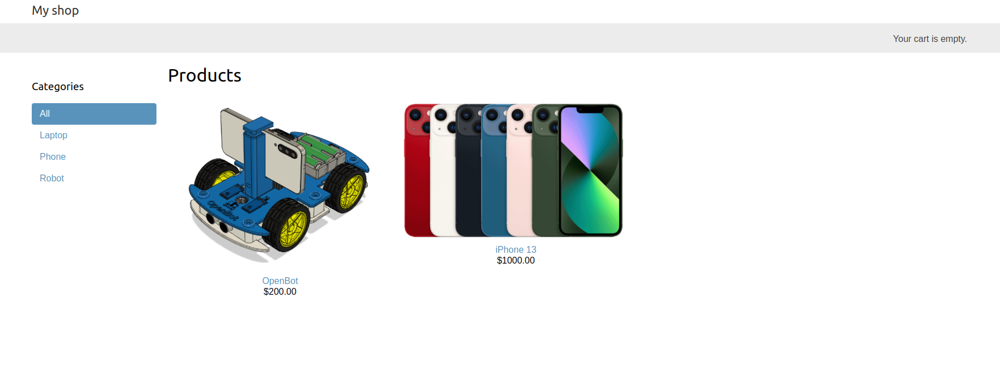
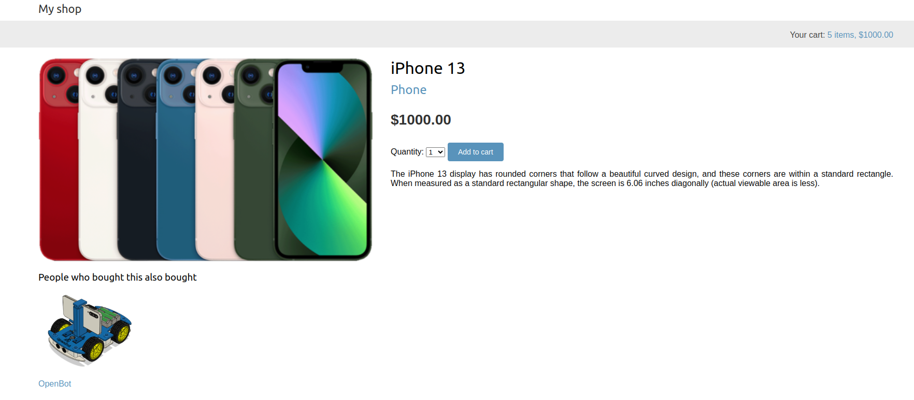
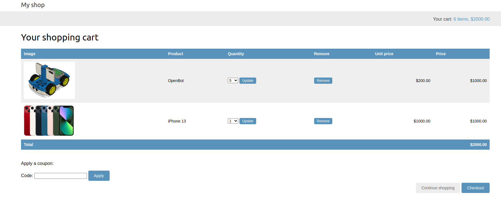
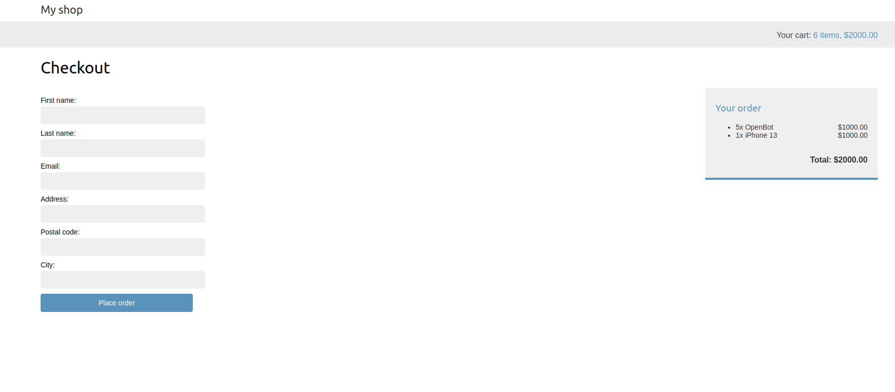
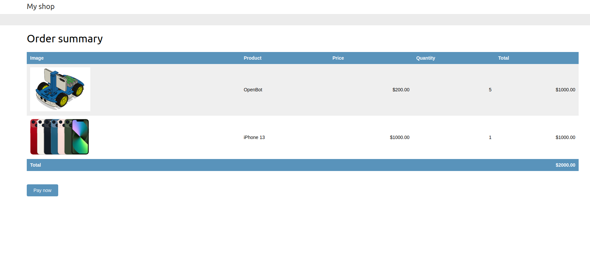
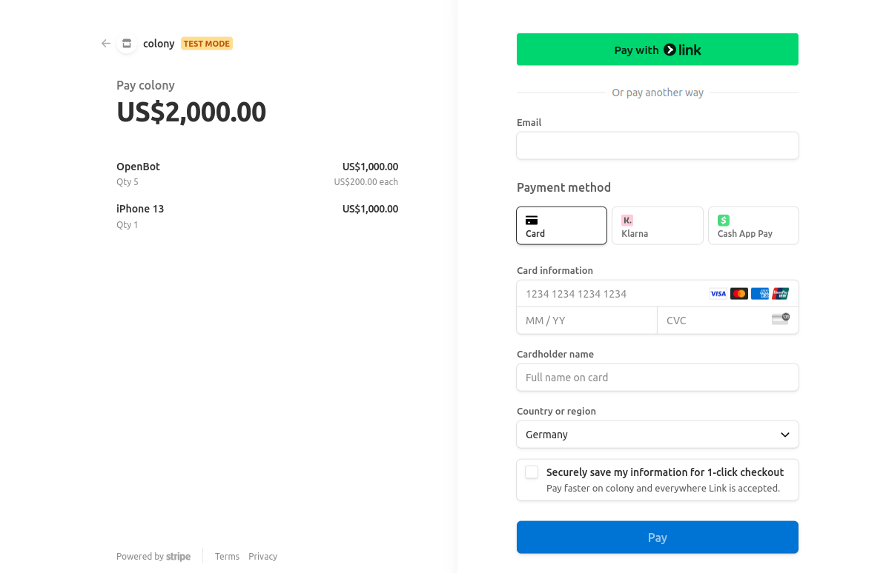
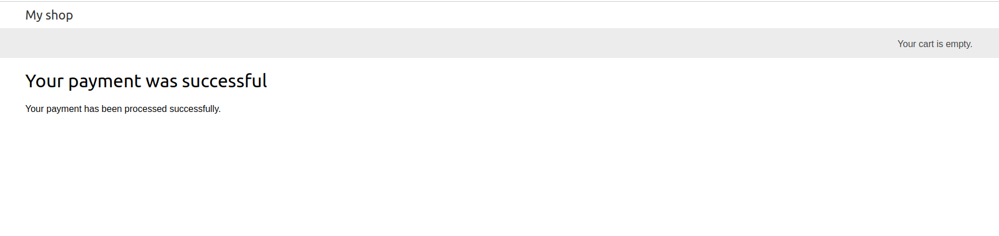

# eShop website

e-commerce website

## UI

## some commands

Note that some items such as the password and username of the database or private key of Stripe have been deleted and must be configured again. And also, in addition to these, RabbitMQ and Celery must be run.

‍‍`$ python manage.py runserver`

and rabbitmq:

`sudo docker run -it --rm --name rabbitmq -p 5672:5672 -p 15672:15672 rabbitmq:management`

and redis:

`sudo docker run -it --rm --name redis -p 6379:6379 redis`

and celery:

`celery -A eShop worker -l info`

and for running **stripe** webhook:

`stripe listen --forward-to localhost:8000/payment/webhook/`

---

thanks to [Antonio Melé](https://github.com/zenx)