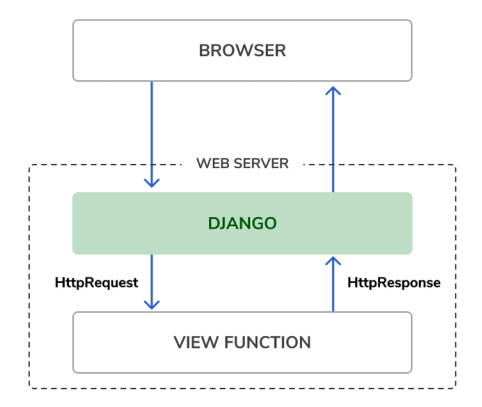
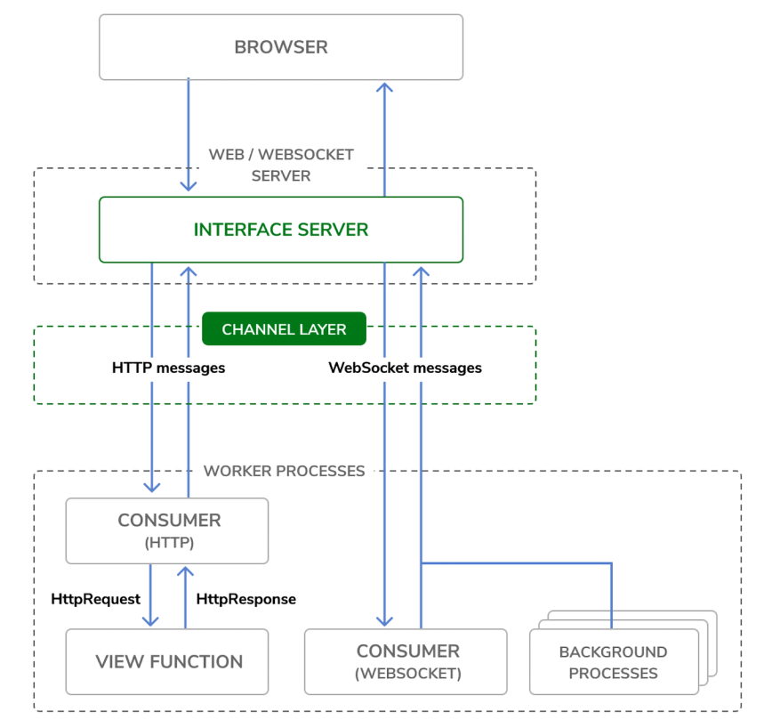
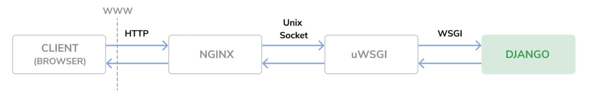
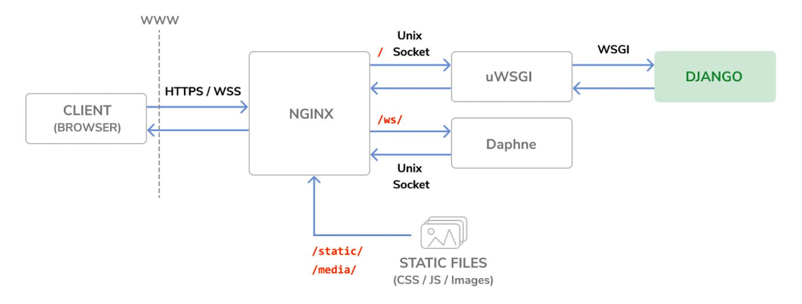
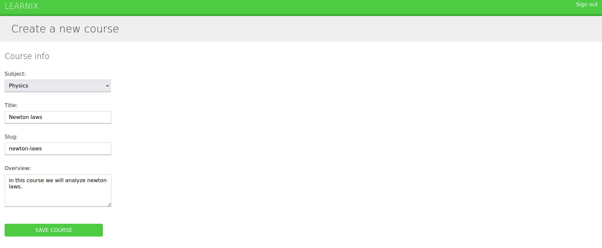
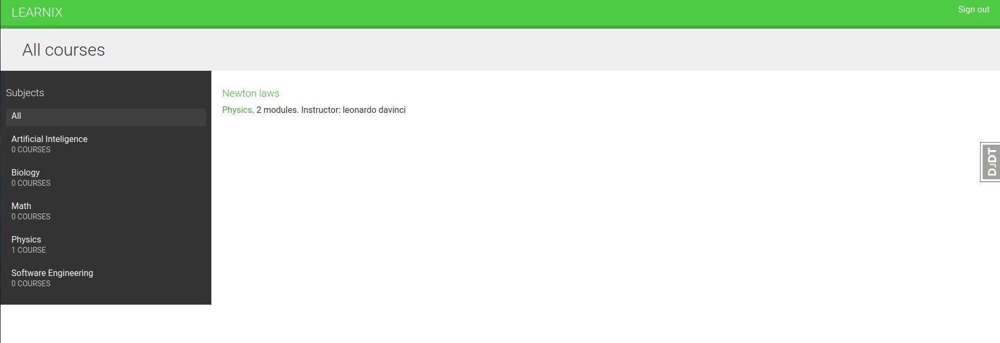
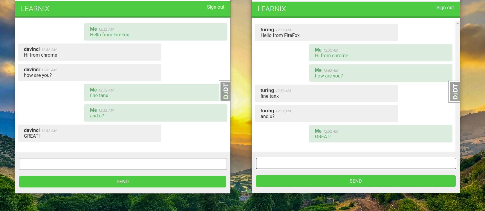

# Learnix App

-> E-Learning Platform

## some commands

for caching system :

`docker pull memcached`

and:

`docker run -it --rm --name memcached -p 11211:11211 memcached -m 64`

or for Redis:

`docker run -it --rm --name redis -p 6379:6379 redis`

consuming api example:

`curl http://127.0.0.1:8000/api/subjects/ | json_pp`

for enrolling:

`curl -i -X POST -u student:password http://127.0.0.1:8000/api/courses/1/enroll/`

specify settings:

`python manage.py runserver --settings=learnix.settings.local`

The command docker compose exec allows you to execute commands in the container. example:

`sudo docker compose exec web python /code/learnix/manage.py migrate`
and:
`docker compose exec web python /code/educa/manage.py createsuperuser`

check for production deployment:

`python manage.py check --deploy --settings=learnix.settings.prod`

generate SSL/TLS certificate:

`openssl req -x509 -newkey rsa:2048 -sha256 -days 3650 -nodes -keyout learnix.key -out learnix.crt -subj '/CN=*.learnix.com' -addext 'subjectAltName=DNS:*.learnix.com'`

executing management command(send emails for enrolling):

`docker compose exec web python /code/learnix/manage.py \ enroll_reminder --days=20 --settings=learnix.settings.prod`

## some important tips

django request/response cycle:

django Channels request/response cycle:

The production environment request/response cycle:

more detail:

## some UI

---

---

---

thanks to [Antonio Melé](https://github.com/zenx)